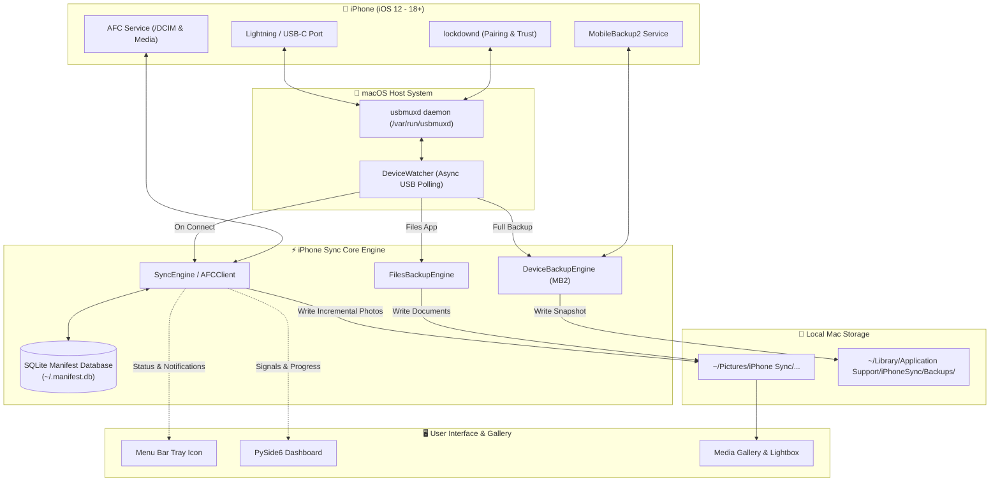

# 📱 iPhone Sync (macOS)

<p align="center">
  
</p>

<p align="center">
  <strong>The private, high-speed, local sync bridge between iOS and macOS.</strong><br>
  Plug in your iPhone via USB. Photos, 4K videos, Files app documents, and full encrypted device backups sync automatically to your Mac. No iCloud subscriptions. No third-party servers. 100% offline.
</p>

<p align="center">
  <a href="#-key-features"></a>
  <a href="#-prerequisites"></a>
  <a href="#-how-it-works"></a>
  <a href="LICENSE"></a>
  <a href="#-privacy--security"></a>
</p>

---

## 💡 Why iPhone Sync?

Apple transitioned sync from iTunes into Finder, leaving users with slow, opaque syncing that pushes everyone toward paid iCloud storage tiers. **iPhone Sync** restores full local control over your device:

- ⚡ **Zero-Click Automation** — plug in your phone, unlock once, and sync starts immediately in the background.
- 📸 **Smart Incremental Media Sync** — skips already-imported media using a local SQLite manifest; never duplicates files.
- 🎞️ **True Apple Media Fidelity** — preserves HEIC originals, Live Photo video pairs, 4K 60fps HDR clips, and metadata untouched.
- 📁 **Files App & Sandboxes** — backs up "On My iPhone" app storage, downloads, books, podcasts, and recordings.
- 🛡️ **Full MobileBackup2 Engine** — creates encrypted, restorable full-device backups (Finder/iTunes format) with health inspection.
- 🖼️ **Built-in Fluid Gallery** — review, browse, and play back your imported photo and video library with hardware-accelerated playback.
- 🔒 **Air-Gapped Privacy** — direct USB bus transfer (`usbmuxd`). Zero cloud communication, zero telemetry, zero accounts.

---

## ✨ Key Features

### 🔌 Intelligent Hotplug & Daemon
- **Auto-Sync on Connect**: Background watcher listens to macOS native `usbmuxd` events. As soon as your device is plugged in and trusted, backup kicks off without opening Finder.
- **Menu Bar Status Agent**: Sits discreetly in your macOS menu bar with real-time transfer indicators and one-click quick actions.
- **LaunchAgent Integration**: Optional "Start at Login" toggle installs a native LaunchAgent (`~/Library/LaunchAgents/com.iphonesync.macos.plist`).

### 📸 Incremental Photos & Videos Sync
- **Camera Roll Extraction**: Accesses `/DCIM` through Apple File Conduit (AFC).
- **Format Support**: `.HEIC`, `.JPG`, `.PNG`, `.DNG` (Apple ProRAW), `.MOV`, `.MP4`, Cinematic Mode, and Slow-Motion.
- **Live Photos Pairing**: Accompanying `.MOV` video clips for Live Photos are linked and backed up alongside still frames.
- **Clean File Hierarchy**: Media is automatically structured chronologically:
  ```text
  ~/Pictures/iPhone Sync/
  └── My_iPhone_00008101-00123456789/
      ├── 2026/
      │   ├── August/
      │   │   ├── IMG_4501.HEIC
      │   │   ├── IMG_4501.MOV
      │   │   └── IMG_4502.MOV
      │   └── September/
      └── .manifest.db
  ```

### 📂 Files App & Documents Backup
- **Media Containers**: Backs up Downloads, Voice Memos, Books, Podcasts, and Purchases.
- **App Document Sharing**: Directly reads and mirrors sandboxed documents from installed apps that enable File Sharing.

### 🛡️ MobileBackup2 Full Device Backup & Restore
- **Encrypted Local Backups**: Full iTunes/Finder-compatible snapshots protected with industry-standard encryption.
- **Backup Inspector**: View device specs, iOS build, backup size, encryption state, and snapshot timestamp.
- **Restore Capability**: One-click restore directly from a previously captured local backup snapshot.

### 🖼️ Standalone Native Media Gallery
- **Chronological Grid**: Instant browsing grouped by date and month with smooth thumbnail scrolling.
- **Full-Screen Lightbox**: Fast HEIC decoder (`pillow-heif`) with keyboard navigation (`←` / `→`).
- **Integrated Video Player**: Streamline playback for high-bitrate 4K videos with PySide6 multimedia and PyAV.

---

## 🏗️ Architecture & How It Works



---

## 📋 Prerequisites

1. **macOS 12.0 (Monterey)** or higher (tested through macOS 15 Sequoia).
2. **Xcode Command Line Tools** (required for native wheel compilation):
   ```bash
   xcode-select --install
   ```
3. **Python 3.11 or 3.12** (installed via Homebrew or official installer):
   ```bash
   brew install python@3.12
   ```
4. **USB Cable** (Original or MFi-certified USB-C or Lightning cable).
5. **Unlocked Device**: Your iPhone must be unlocked with **"Trust This Computer"** approved.
6. **Local Storage Note**: Only photos stored locally on the device are accessible over the USB bus. Photos optimized exclusively in iCloud without local copies cannot be read over direct USB.

---

## 🚀 Quick Start

### Download the Mac app (recommended)

1. Open **[Releases](https://github.com/dandotiyagpt/iphone-sync-macos/releases)** and download `iPhoneSync-macos-*.dmg`.
2. Open the disk image and drag **iPhone Sync** into **Applications**.
3. First launch: **right-click the app → Open** (the build is unsigned, so Gatekeeper asks once).

The GitHub Actions Mac runner produces an **Apple Silicon (M1+)** disk image. Intel Macs should use the source install below.

### Install from source

Clone the repository and run the automated installation script:

```bash
git clone https://github.com/dandotiyagpt/iphone-sync-macos.git
cd iphone-sync-macos
./install.sh
```

`install.sh` automatically creates an isolated virtual environment (`.venv`), installs all core and dev dependencies, and sets up executable shortcuts.

### Launch from source

You can launch the app via the command-line entrypoint:

```bash
# Launch the main sync daemon and dashboard
python -m iphone_sync

# Or use the installed CLI command
iphone-sync-macos

# Or open directly into the Gallery viewer
iphone-gallery-macos
```

Alternatively, you can double-click **`run-sync.command`** or **`run-gallery.command`** directly in Finder!

### Build a `.dmg` yourself (macOS)

```bash
./install.sh
./build.sh
```

That writes `dist/iPhone Sync.app` and `dist/iPhoneSync-macos-<version>.dmg`. Drag the app into `/Applications`, or distribute the DMG. Tag `v1.0.2` (or any `v*`) to have GitHub Actions attach the DMG to a Release.

---

## 🕹️ Usage & Walkthrough

1. **First Connection**:
   - Plug your iPhone into your Mac using a USB cable.
   - Unlock your iPhone screen. When prompted with **"Trust This Computer?"**, tap **Trust** and enter your passcode.
2. **Automatic Sync**:
   - iPhone Sync detects the pairing within seconds.
   - The status indicator switches to **Syncing...** and streams real-time file copy counters.
3. **Gallery Browsing**:
   - Click the **Library** tab (or press `Cmd+L`) to open the gallery.
   - Click any photo to inspect full-resolution HEIC details.
   - Press `Space` to play/pause video clips; navigate with `Left` / `Right` arrow keys.
4. **Running in Background**:
   - Closing the main window keeps iPhone Sync running in your macOS menu bar.
   - Every time you plug your iPhone in to charge, your pictures and documents are silently backed up!

---

## ⚙️ Settings Reference

Open **File → Settings** (or `Cmd+,`) to customize your sync preferences:

| Setting | Default | Description |
|:--------|:-------:|:------------|
| **Destination Folder** | `~/Pictures/iPhone Sync` | Directory where synced photos and folders are preserved. |
| **Auto-sync on plug-in** | `Enabled` | Automatically trigger sync as soon as a recognized iPhone is plugged in. |
| **Organize by Date** | `Enabled` | Saves files into `YYYY/MonthName` hierarchical subdirectories. |
| **Start at Login** | `Enabled` | Installs a persistent macOS `LaunchAgent` to monitor connections on boot. |
| **Minimize to Menu Bar** | `Enabled` | Closing the main window docks the app to the menu bar instead of quitting. |
| **Full Encrypted Backup** | `On Demand` | Run full MobileBackup2 disk image snapshots. |

---

## 📂 Storage & Database Layout

All configuration, logs, and indexing databases adhere strictly to standard macOS filesystem conventions:

```text
~/Pictures/iPhone Sync/                           <-- Synced media & app folders
~/Library/Application Support/iPhoneSync/
├── config.json                                   <-- User preferences
├── manifest.db                                   <-- SQLite incremental sync index
└── Backups/                                      <-- MobileBackup2 full backups
~/Library/Caches/iPhoneSync/thumbnails/           <-- Optimized media cache
~/Library/LaunchAgents/com.iphonesync.macos.plist <-- Auto-start configuration
```

---

## ⌨️ Gallery Keyboard Shortcuts

| Key | Action |
|:---:|:-------|
| `←` / `→` | Previous / Next media item |
| `Space` | Play / Pause video playback |
| `F` | Toggle Fullscreen view |
| `Cmd + R` | Refresh gallery grid from disk |
| `Esc` | Exit media viewer back to grid |

---

## 🩺 Troubleshooting

<details>
<summary><strong>Device not detected / "Waiting for iPhone..."</strong></summary>

- Unplug and reconnect the USB cable.
- Ensure your iPhone is unlocked. If prompted, tap **"Trust This Computer"** and enter your passcode.
- Check if `usbmuxd` is running by verifying in Terminal:
  ```bash
  system_profiler SPUSBDataType
  ```
- Make sure you are using a data-capable cable (some cheap cables only support charging).
</details>

<details>
<summary><strong>Missing photos or videos during sync</strong></summary>

- If **iCloud Photos** is enabled with **"Optimize iPhone Storage"**, full-resolution originals might only reside in the cloud and cannot be copied over local USB.
- To sync them, ensure they have been downloaded locally or toggle **"Download and Keep Originals"** in iOS Settings → Photos.
</details>

<details>
<summary><strong>Native build errors (`pillow-heif` / `av`)</strong></summary>

- Ensure Xcode Command Line Tools are properly installed:
  ```bash
  xcode-select --install
  ```
- If running on Apple Silicon (M1/M2/M3/M4), ensure you are running a native `arm64` Python environment rather than an emulated Rosetta shell.
</details>

---

## 🛡️ Privacy & Security

- **Air-Gapped Operation**: iPhone Sync does not make outbound network calls, contain analytics trackers, or require an account.
- **Direct USB Bus Communication**: Data flows directly from the iPhone hardware bus via macOS socket `/var/run/usbmuxd`.
- **Encrypted Backups**: MobileBackup2 protocol leverages Apple's standard AES-256 backup encryption.

---

## 🧪 Testing

Run the comprehensive unit and integration test suite:

```bash
# Run all tests
pytest

# Run fast unit tests
pytest -m unit

# Run with coverage report
pytest --cov=iphone_sync tests/
```

---

## 🤝 Contributing

Contributions, issues, and feature requests are welcome!

1. Fork the repository
2. Create your feature branch (`git checkout -b feature/amazing-feature`)
3. Commit your changes (`git commit -m 'feat: add amazing feature'`)
4. Push to the branch (`git push origin feature/amazing-feature`)
5. Open a Pull Request

---

## 📄 License

Distributed under the **MIT License**. See [`LICENSE`](LICENSE) for more details.

<p align="center">
  Crafted with ❤️ for macOS and iOS power users.
</p>
